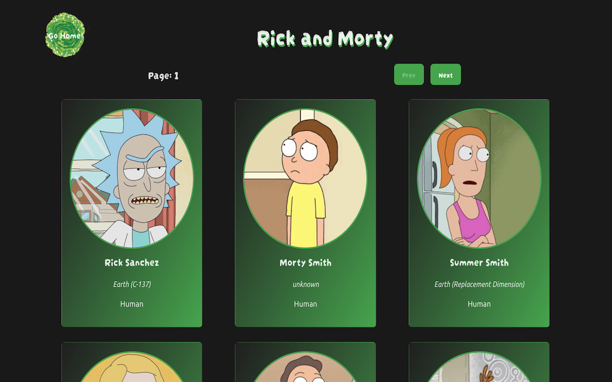

# Rick and Morty web

Página construida para practicar **_ReactJS_** y aprender a consumir una API, en este caso consumí la API de Rick and Morty.

Con esto sigo practicando **_React Router_** al construirla como una _Single Page Application_.
Esta vez utilicé los servicios de railway para desplegar el código.

